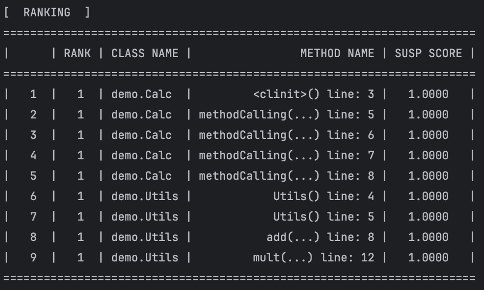
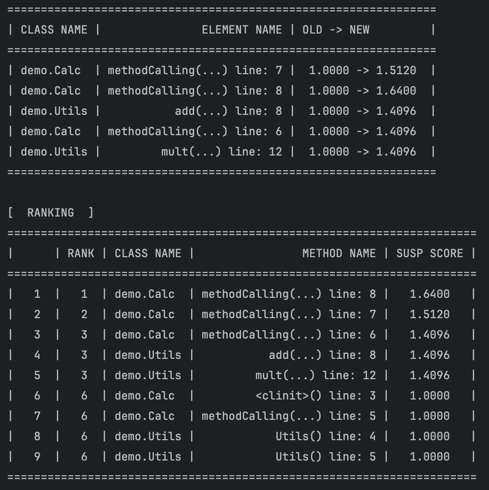
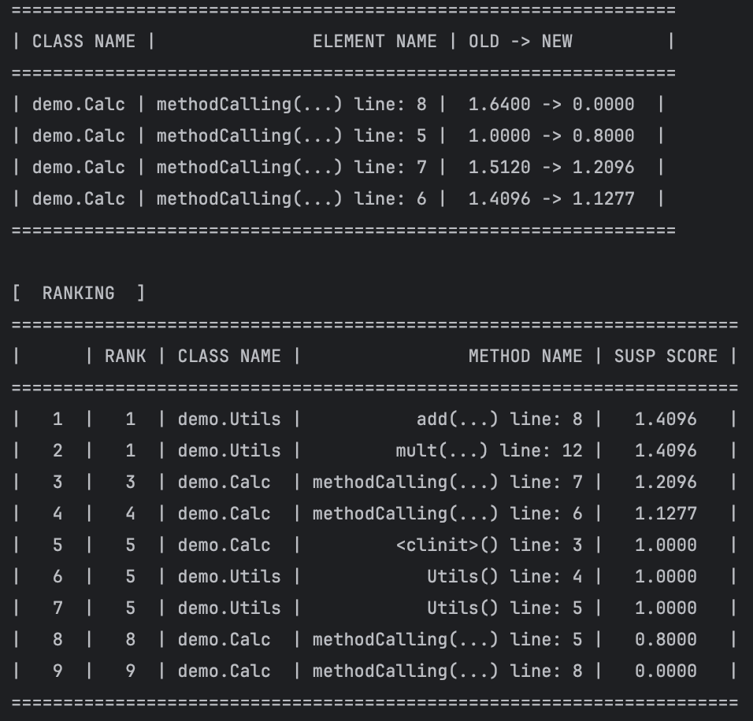

# FaultFinder 
## 概要
このプログラムはJavaを対象とした対話的なデバッグ支援ツール用のライブラリです。[Jupyter](https://jupyter.org/)や[JISDLab](https://tklab-group.github.io/JISDLab/contents/ja/)のような 対話型のjava環境に組み込んで使用することを想定していますが、デモ用プログラム(src/test/java/demo/FaultFinderDemo.java)のようにこのライブラリ単体でデバッグ支援ツールとして使用することもできます。

本ライブラリは、既存のデバッグ支援手法に基づいたランキングに対してデバッグ中の開発者の知識をフィードバックとして与えることでランキングを更新し精度を向上させる、iFL[^1]手法の機能を提供します。本ライブラリはフィードバック操作としてiFLで提案されているremove, susp操作に加えて、開発者が観測した「異常値を取る変数」を入力としてランキングを更新するprobe操作[^2]を導入している点が大きな特徴です。

## 本ライブラリを用いたデバッグ作業の流れ
本ライブラリでは、まず既存のデバッグ支援手法であるSBFL[^3]に基づいて行単位のバグを含むか否かに関する「怪しさ」の度合い(疑惑値)を計算し、ランキングによって開発者が調べるべきコードの優先順位を提示します。開発者はランキングを参考に調査するコード行を決定しバグの原因が含まれているかを調べる、という作業を繰り返す中でバグの原因箇所を特定します。

デバッグ作業の中で開発者は以下の3つの操作によってフィードバックを行い、ランキングを更新することができます。これにより、ユーザのデバッグ時に得た重要な情報がランキングが反映され、従来のSBFL手法に比べてより効率的にバグ箇所の特定が行えることが期待されます。開発者が行うことができるフィードバック操作は以下の3つです。
- ### remove [iFL]

    あるコード行を調査した結果、このコードの周辺(メソッド)にはバグの原因は含まれないと判断した際に行う操作です。この操作によって調査を行なった行の疑惑値は0となり、その行と同じメソッドに属する全ての行の疑惑値が減少します。疑惑値の減少は元の疑惑値に定数(0 < t1 < 1)をかけることで行われます。この操作は「開発者がある行を調査する際に、その周辺の行も同時に調査を行う傾向にある」という考えに基づいており、これによって開発者が一度調査した行を複数回調査するという状況を回避することができます。

- ### susp [iFL]
  あるコード行を調査した結果、このコード自体にはバグの原因は含まれないものの、周辺(メソッド)は依然としてバグの原因を含む可能性があると判断した際に行う操作です。疑惑値の増加は元の疑惑値に定数(1 < t1 < 2)をかけることで行われますこの操作によって調査を行なった行の疑惑値は0となり、その行と同じメソッドに属する全ての行の疑惑値が増加します。この操作もremove操作と同じ考えに基づいており、これによって開発者が怪しいと考えている範囲を優先的に推薦する形にランキングが変化します。

- ### probe
    デバッグ作業中に、開発者が想定外の値を取る変数を発見した場合に行う操作です。代表的なものとしてテストケースのAssert文中でactualとして与えられている変数が挙げられます。この操作が実行されると、その変数が想定外の値を取るに至った原因となり得る行の集合を複数回のテスト実行によって特定し、それらの行の疑惑値を増加させます。増加量はそれぞれのコード行について異なり、与えられた変数との関係性に基づいて決定しています。

## 使用方法
### 0. デバッグ対象コードのディレクトリ情報の設定
fl_properties/fl_config.properties ファイルにデバッグを行いたいコードの以下のディレクトリ情報を全て保存します。デフォルトではデモ用プログラムのディレクトリが設定されています。
```properties
targetSrcDir={プロダクションコードのソースディレクトリ} 
testSrcDir={テストコードのソースディレクトリ}
targetBinDir={プロダクションコードのバイナリディレクトリ}
testBinDir={テストコードのバイナリディレクトリ}
```


### 1. FaultFinderオブジェクトの生成
```java
import jisd.fl.*;

MethodElementName targetTestClass = new MethodElementName("demo.SampleTest");
FaultFinder faultFinder = new FaultFinder(targetTestClass);
```
MethodElementNameはデバッグ対象コードの特定のメソッドを表すクラスで、メソッド名を省略した場合はクラスを表すオブジェクトとして扱われます。ここでは失敗の原因を特定したテストケースが含まれるテストクラスを渡してFaultFinderオプジェクトを生成します。

FaultFinderオプジェクト生成のタイミングで、与えられたテストクラスに属する全てのテストケースに対してSBFLに基づいた疑惑値計算のためのカバレッジ計測が自動的に行われます。

### 2.ランキングの閲覧
```java
faultFinder.printRanking(10);
```
printRankingメソッドによって上位から与えられた要素数までの現在のランキングを表示することができます。引数を省略した場合全要素のランキングが出力されます。ランキングへの操作を行なっていない場合、出力されるランキングはSBFL手法によるものと等しくなります。

### 3. ランキングへの操作
- **remove / susp 操作**
  
    ```java
    faultFinder.remove(1);
    faultFinder.susp(2);
    ```
    操作の対象となるコード行をランキングの通し番号によって指定します。操作の実行後、疑惑値が変更されたコード行の一覧と更新後のランキングが出力されます。


- **probe 操作**
    ```java
   SuspiciousVariable targetValue = new SuspiciousVariable(
        new MethodElementName("org.sample.SampleTst#sampleTest()"),
        new MethodElementName("org.sample.BuggyClass#buggyMethod()"),
        "result",
        "4",
        true,
        false
    ); 
  
    faultFinder.probe(targetValue);
    ```
    SuspiciousVariableオブジェクトによって、異常値を取る変数の情報を与えます。操作の実行後、疑惑値が変更されたコード行の一覧と更新後のランキングが出力されます。

    SuspiciousVariableオブジェクトには、失敗するテストケース名、対象の変数が属するクラス／メソッド名、変数名、変数が実際に取る異常値、フィールドか否か、配列か否か、の情報が含まれます。
    現在は異常値を取る変数に指定できるのはプリミティブ型のフィールドまたはローカル変数のみで、配列や参照型には非対応です。

## 使用例
デモ用プログラム(demo.FaultFinderDemo#example())を例に使用例を示します。プログラムの詳細はソースコード(src/main/java/demo, src/test/java/demo)を参照してください。

まず、失敗テストケースを含むテストクラスを指定してFaultFinderクラスを生成し、初期のランキングを出力します。この例で実際にバグを含むのはdemo.Utils#mult(int, int)の12行目です。

```java
        FaultFinder faultFinder = new FaultFinder(failedTestMethodName);
        faultFinder.printRanking();
```

テストケースの数が不足しているため、SBFL手法が適切に機能せず、全ての要素が同率になっています。


ここで、テストケース内のローカル変数actualを対象としてprobe操作を行うことでランキングを更新します。

```java
        SuspiciousVariable targetValue = new SuspiciousVariable(
        failedTestMethodName,
        failedTestMethodName.getFullyQualifiedMethodName(),
        "actual",
        "4",
        true,
        false
        );

        faultFinder.probe(targetValue);
```
これにより、書くコード行の疑惑値が差別化され優先して調査すべき行が絞り込まれます。


このランキングを踏まえ、1位にランクづけされているdemo.Calc#methodCalling(...)の8行目を調査します。その結果、この行やその周辺にはバグが含まれていないことがわかったため、調査した行に対してremove操作を適用します。

```java
      faultFinder.remove(1);
```

この操作で、実際にバグを含むdemo.Utils#mult(int, int)の12行目が最上位にランク付けされ、2回以内の調査でバグ箇所を特定することができます。



このように、開発者によるフィードバックによって効率的にバグ箇所特定作業を進めることができます。

[^1]: F.Horváth et al. A new interactive fault localization method with context aware user feedback. In IBF, pp. 23–28, 2019.

[^2]: 江﨑 政哉，小林 隆志, 観測に基づく表明違反原因推定を用いた対話的欠陥箇所特定, 電子情報通信学会 信学技報 No. SS2024-68 (Vol.124, No.429, pp.146 - 151), ソフトウェアサイエンス研究専門委員会 2025年3月研究会

[^3]: Qusay I. Sarhan, et al. A survey of challenges in spectrumbased software fault localization. IEEE Access, Vol. 10, pp.10618–10639, 2022.